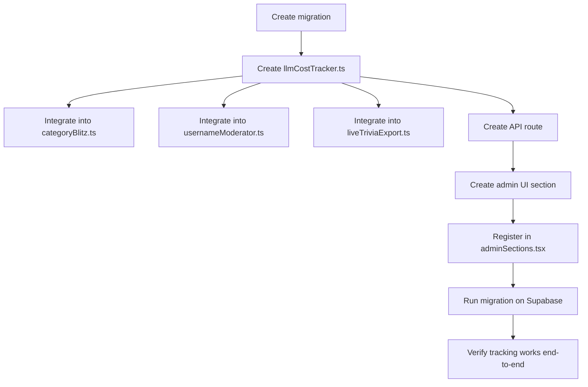

# In-App LLM Cost Observability — Architecture

## Problem

The project calls multiple LLMs at runtime (Anthropic Claude Haiku for Category Blitz grading and username moderation, Google Gemini for live trivia rewrite) and in scripts (Opus for letter backfilling, Gemini Flash for nightly trivia generation). There is currently **zero visibility** into:

- How many LLM calls are made per day/week/month
- How many input/output tokens are consumed
- What each call actually costs
- Which features drive the most LLM spend

Without this data, it's impossible to monitor costs, detect regressions, or make informed decisions about model selection (e.g., is Haiku sufficient or could we use an even cheaper model?).

## Design Goals

1. **Track every runtime LLM call** — log provider, model, token counts, feature name, and computed cost to a database table
2. **Minimal instrumentation overhead** — a thin wrapper function per provider that logs after the call succeeds, without modifying retry/fallback logic
3. **Admin dashboard visibility** — a new admin section showing usage summaries (this month, this week, by feature)
4. **No third-party dependencies** — pure DB inserts with deterministic cost computation from known pricing tables
5. **Cost estimation is approximate** — we compute cost from (model, input_tokens, output_tokens) x published pricing. This won't match Anthropic/Google invoices perfectly (volume discounts, tax, etc.) but will be within ~5-10%

## Scope

**Included** (runtime LLM calls):
- [`lib/categoryBlitz.ts`](lib/categoryBlitz.ts:163) — `anthropic.messages.create()` (Haiku 4.5) for answer grading
- [`lib/usernameModerator.ts`](lib/usernameModerator.ts:232) — `client.messages.create()` (Haiku 4.5) for username moderation
- [`lib/liveTriviaExport.ts`](lib/liveTriviaExport.ts:134) — `callGeminiForLiveRewrite()` (Gemini 2.5 Flash) for live trivia rewrite

**Excluded** (scripts, not runtime):
- [`scripts/lib/category-blitz-letters.cjs`](scripts/lib/category-blitz-letters.cjs:21) — Opus 4.8 (manual script, runs in CI or on demand)
- [`scripts/generate-trivia-nightly.cjs`](scripts/generate-trivia-nightly.cjs) — Gemini (nightly cron script)
- [`scripts/generate-live-trivia-questions.cjs`](scripts/generate-live-trivia-questions.cjs:47) — Gemini 1.5 Flash (manual script)

These could be added in a future pass, but their costs are negligible relative to runtime calls.

## Database Table

### Migration: `supabase/migrations/20260708140000_llm_usage_logs.sql`

```sql
-- Tracks every runtime LLM API call for cost observability.
-- One row per API call (not per message in a streaming conversation).
-- Cost is computed server-side from known pricing tables, not from the provider's billing API.

CREATE TABLE llm_usage_logs (
  id          uuid PRIMARY KEY DEFAULT gen_random_uuid(),
  provider    text NOT NULL CHECK (provider IN ('anthropic', 'gemini')),
  model       text NOT NULL,                           -- e.g. 'claude-haiku-4-5-20251001', 'gemini-2.5-flash'
  feature     text NOT NULL,                           -- e.g. 'category_blitz_grading', 'username_moderation', 'live_trivia_rewrite'
  input_tokens  integer NOT NULL CHECK (input_tokens >= 0),
  output_tokens integer NOT NULL CHECK (output_tokens >= 0),
  cost_cents    numeric(10,4) NOT NULL CHECK (cost_cents >= 0),  -- estimated cost in USD cents (e.g. 0.1216 = ~$0.0012)
  metadata    jsonb,                                    -- optional: feature-specific context (letter, round_id, etc.)
  created_at  timestamptz NOT NULL DEFAULT now()
);

-- Indexes for common query patterns
CREATE INDEX idx_llm_usage_logs_created_at ON llm_usage_logs(created_at DESC);
CREATE INDEX idx_llm_usage_logs_feature    ON llm_usage_logs(feature);
CREATE INDEX idx_llm_usage_logs_provider   ON llm_usage_logs(provider);

-- RLS: only admin/service role can read/write; anon/public cannot access
ALTER TABLE llm_usage_logs ENABLE ROW LEVEL SECURITY;

-- Service role (supabaseAdmin) bypasses RLS, but define a restrictive policy anyway
CREATE POLICY "llm_usage_logs_service_role_only" ON llm_usage_logs
  USING (auth.role() = 'service_role');
```

### Design Notes

- `cost_cents` uses `numeric(10,4)` — this stores up to $999,999.9999 in cents with 4 decimal places (sub-cent precision). For example, $0.0012 would be stored as `0.1200` (cents).
- `metadata` is a JSONB column for arbitrary context — e.g., `{"letter": "A", "round_id": "abc-123"}` for category blitz grading, or `{"username": "test_user"}` for moderation. This makes debugging specific call patterns possible.
- No foreign key to other tables — this is a pure audit/log table. Referential integrity is unnecessary and would complicate insert speed.

## Wrapper Module: `lib/llmCostTracker.ts`

This is the core module. It exports:

### Pricing Tables

```typescript
// Prices in USD per 1M tokens (source: published pricing as of July 2026)
const ANTHROPIC_PRICING: Record<string, { input: number; output: number }> = {
  "claude-haiku-4-5-20251001": { input: 0.80, output: 4.00 },
  "claude-haiku-4-5":          { input: 0.80, output: 4.00 },
  "claude-opus-4-8":           { input: 15.00, output: 75.00 },
};

const GEMINI_PRICING: Record<string, { input: number; output: number }> = {
  "gemini-2.5-flash": { input: 0.15, output: 0.60 },
  "gemini-1.5-flash": { input: 0.075, output: 0.30 },
};
```

### Core Functions

#### `estimateCost(model, inputTokens, outputTokens)`

Pure function that computes estimated cost from token counts and pricing table:

```
cost = (inputTokens / 1_000_000) * inputPrice + (outputTokens / 1_000_000) * outputPrice
```

Returns cost in USD cents (as a number).

#### `trackAnthropicUsage(response, feature, metadata?)`

Accepts an Anthropic `Message` object, extracts `usage` field, computes cost, and inserts into `llm_usage_logs`:

```typescript
async function trackAnthropicUsage(
  response: { usage: { input_tokens: number; output_tokens: number } },
  model: string,
  feature: string,
  metadata?: Record<string, unknown>,
): Promise<void> {
  const { input_tokens, output_tokens } = response.usage;
  const costCents = estimateCost(model, input_tokens, output_tokens);
  // Insert into llm_usage_logs via supabaseAdmin
}
```

This is intentionally fire-and-forget — a failed insert should never bubble up and crash the calling code. Wrap in try/catch with a `console.warn`.

#### `trackGeminiUsage(response, model, feature, metadata?)`

Similar but for the Gemini response shape:

```typescript
async function trackGeminiUsage(
  response: { usageMetadata?: { promptTokenCount?: number; candidatesTokenCount?: number } },
  model: string,
  feature: string,
  metadata?: Record<string, unknown>,
): Promise<void> {
  const input_tokens = response.usageMetadata?.promptTokenCount ?? 0;
  const output_tokens = response.usageMetadata?.candidatesTokenCount ?? 0;
  const costCents = estimateCost(model, input_tokens, output_tokens);
  // Insert into llm_usage_logs via supabaseAdmin
}
```

### Cost Estimation Helpers

#### `getCostSummary(from, to)` — aggregate query for admin dashboard

Returns an object with:
- `totalCostCents` — sum of cost_cents in range
- `totalCalls` — count of rows
- `totalInputTokens`, `totalOutputTokens`
- `byFeature` — breakdown per feature
- `byModel` — breakdown per model

#### `cleanupOldRecords(retentionDays)` — optional scheduled cleanup

Deletes records older than `retentionDays` (default 90). Called from a cron endpoint.

### Type Export

```typescript
export type LlmUsageFeature =
  | "category_blitz_grading"
  | "username_moderation"
  | "live_trivia_rewrite";
```

## Integration Points

### 1. [`lib/categoryBlitz.ts`](lib/categoryBlitz.ts:163) — Anthropic Answer Grading

After a successful `anthropic.messages.create()`, add:

```typescript
import { trackAnthropicUsage } from "@/lib/llmCostTracker";

// Inside the try block, after success:
await trackAnthropicUsage(message, "claude-haiku-4-5-20251001", "category_blitz_grading", {
  letter,
  round_id: "...",  // pass roundId if available
  answer_count: requests.length,
}).catch(() => {});  // fire-and-forget, never crash
```

**Important**: This must go inside the `try` block (after `clearTimeout(timeout)`) but before the `return`. If the insert fails, the catch block in the wrapper silences it — the grading result is NOT affected.

### 2. [`lib/usernameModerator.ts`](lib/usernameModerator.ts:232) — Anthropic Username Moderation

After a successful `client.messages.create()`, add:

```typescript
import { trackAnthropicUsage } from "@/lib/llmCostTracker";

// After line 237 (after getting text from response):
await trackAnthropicUsage(message, "claude-haiku-4-5", "username_moderation", {
  username: username.slice(0, 50),  // truncate for privacy
}).catch(() => {});
```

### 3. [`lib/liveTriviaExport.ts`](lib/liveTriviaExport.ts:134) — Gemini Live Trivia Rewrite

After a successful Gemini response (after line 164, after extracting text), add:

```typescript
import { trackGeminiUsage } from "@/lib/llmCostTracker";

await trackGeminiUsage(data, "gemini-2.5-flash", "live_trivia_rewrite").catch(() => {});
```

Note: The Gemini response structure includes `data.usageMetadata` which contains `promptTokenCount` and `candidatesTokenCount`. The `data` variable is already available in scope at line 157.

## Admin Dashboard Section

### New File: [`components/admin/sections/LlmCostSection.tsx`](components/admin/sections/LlmCostSection.tsx)

A `"use client"` React component that:

1. **Summary cards** — total cost this month, this week, total calls, average cost per call
2. **Breakdown by feature** — a table with columns: Feature | Calls | Input Tokens | Output Tokens | Total Cost
3. **Breakdown by model** — similar table grouped by model name
4. **Recent calls** — scrollable list of recent log entries with time, feature, model, tokens, cost
5. **Date range filter** — simple preset buttons: "Today", "This Week", "This Month", "All"

Data fetched from a new API route: [`app/api/admin/llm-cost/route.ts`](app/api/admin/llm-cost/route.ts)

The component follows the same pattern as other admin sections (e.g., [`TriviaAnswerGraderSection`](components/admin/sections/TriviaAnswerGraderSection.tsx)). See diagram below for rendering.

### Registration in [`components/admin/adminSections.tsx`](components/admin/adminSections.tsx:87)

```typescript
import { LlmCostSection } from "@/components/admin/sections/LlmCostSection";

// Add to ADMIN_SECTION_OPTIONS
{ id: "llm-cost", label: "LLM Cost", slug: "llm-cost", status: { label: "New", tone: "live" }, component: LlmCostSection },

// Add to "Operations" nav group
items: ADMIN_SECTION_OPTIONS.filter((opt) => ["pickem-settlement", "llm-cost"].includes(opt.id)),
```

## API Route: [`app/api/admin/llm-cost/route.ts`](app/api/admin/llm-cost/route.ts)

Simple GET endpoint that accepts query params:
- `range` — `"today" | "week" | "month" | "all"` (default: `"month"`)
- `feature` — optional filter

Returns JSON with:
```json
{
  "summary": {
    "totalCostCents": 12.3456,
    "totalCalls": 42,
    "totalInputTokens": 15000,
    "totalOutputTokens": 3000
  },
  "byFeature": [
    { "feature": "category_blitz_grading", "calls": 30, "inputTokens": 12000, "outputTokens": 2000, "costCents": 9.5 },
    ...
  ],
  "byModel": [...],
  "recent": [
    { "id": "...", "createdAt": "...", "feature": "...", "model": "...", "inputTokens": 500, "outputTokens": 100, "costCents": 0.05 }
  ]
}
```

## Implementation Sequence



## Cost Projection (what we'd expect to see)

Based on the earlier cost analysis:

| Feature | Est. Monthly Calls | Est. Monthly Cost |
|---------|-------------------|-------------------|
| Category Blitz grading (Haiku) | ~150-500 | $0.11-0.36 |
| Username moderation (Haiku) | ~50-200 | <$0.01 |
| Live trivia rewrite (Gemini 2.5 Flash) | ~0-100 | $0-2.00 |
| **Total** | | **$0.11-2.36/mo** |

These figures are small, but the observability infrastructure is critical for:
- Detecting regressions (e.g., a code change that doubles LLM calls)
- Making model-switching decisions (e.g., trying Gemini for grading instead of Haiku)
- Proving to stakeholders that LLM costs are under control

## Out of Scope (Future)

- **Script cost tracking** — `generate-trivia-nightly.cjs`, `generate-live-trivia-questions.cjs`, `category-blitz-letters.cjs`. These run in CI or manually. Could be added later by importing the same `trackAnthropicUsage`/`trackGeminiUsage` functions.
- **Per-venue cost breakdown** — the metadata column could be extended with `venue_id` in the future, but the current LLM calls are not venue-scoped (grading is game-wide, moderation is system-wide).
- **Real-time cost alerts** — could be added as a future cron job that checks if cost exceeds a threshold.
- **Anthropic/Vercel dashboard integration** — the Supabase data could be exported/compared against Anthropic Console or Vercel Analytics, but that's a separate effort.
